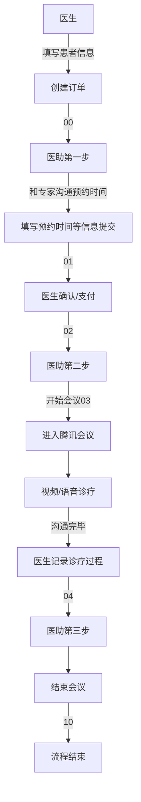

# 公众号H5页面

## 项目启动 

```bash
cd <project>
npm install

# 开发模式启动
npm run dev

# 项目打包
npm run build

# eslint格式化代码
npm run lint
```
## 角色字段和划分

|角色|操作|返回字段|
|---|---|---|
|医生|增删该查|doctor|
|专家|增删该查|expert|
|医护|增删改查|assistant|
|患者|查|patient|

## 状态权限

|状态|权限|
|---|---|
|01(预约中)|医助可以编辑,医生可以修改,专家无,患者查看|
|02(待支付)|医生可以操作,医护可以查看,专家无,患者查看|
|03(待会诊)|医助通知视频,视频结束后通知,医生查看,专家无,患者查看|
|04(待开方)|专家给出意见,~~医生给出处方~~,医助结束流程,患者查看|
|10(结束)|专家可以查看,医生可以查看,~~医助可以查看~~,患者可以查看|

## 项目介绍和流程

> 此项目有4个角色,分别是医生,医助,患者和专家. 6种状态,00是创建订单,01是预约专家中,02是医生待确认状态,03是待会诊状态,04是待开方状态,10是结束.



## 项目地址

**测试地址: http://10.17.1.92**

**线上地址: https://hdmp.hdzyhosp.com/doctor/v2**
